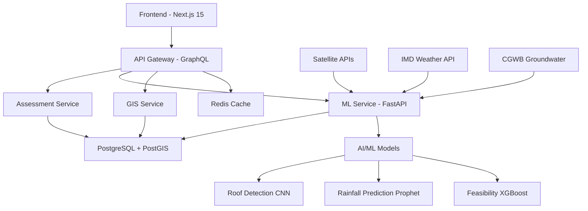

# 🌊 AquaHarvest - AI-Powered Rainwater Harvesting Assistant
 
> Transforming India's water conservation efforts through AI-powered rooftop rainwater harvesting assessment

[](https://nodejs.org/)
[](https://python.org/)
[](https://nextjs.org/)
[](https://fastapi.tiangolo.com/)

## 🚀 Project Overview

AquaHarvest is a revolutionary AI-powered platform that provides on-spot assessment of rooftop rainwater harvesting (RTRWH) and artificial recharge potential. Our solution combines cutting-edge machine learning, satellite imagery analysis, and real-time data integration to democratize water conservation across India.

### 🎯 Problem Statement
India receives 4,000 BCM of rainfall annually but captures less than 8%. With 60% of districts affected by groundwater depletion, there's an urgent need for accessible, intelligent water harvesting solutions.

### 💡 Our Solution
- **AI-Powered Roof Detection** from satellite imagery
- **Smart Recommendation Engine** with cost-benefit analysis  
- **AR Visualization** for structure placement
- **Government Dashboard** for policy impact tracking
- **Multi-language Support** for nationwide accessibility

## 🏗️ Architecture Overview



## 🛠️ Tech Stack

### Frontend
- **Next.js 15** with App Router
- **Tailwind CSS** + Shadcn UI components
- **React** with TypeScript
- **Framer Motion** for animations
- **Mapbox** for visualization
- **AR.js** for augmented reality

### Backend Services
- **GraphQL Gateway** (Apollo Server)
- **Node.js** microservices with Express
- **Python FastAPI** for ML operations
- **PostgreSQL** with PostGIS extension
- **Redis** for caching

### AI/ML Pipeline
- **TensorFlow/PyTorch** for computer vision
- **XGBoost** for feasibility scoring
- **Prophet** for rainfall prediction
- **OpenCV** for image processing
- **Google Earth Engine** for satellite data

### Infrastructure
- **Docker** & **Docker Compose**
- **Kubernetes** for production
- **GitHub Actions** CI/CD
- **Terraform** for IaC

## 🚀 Quick Start

### Prerequisites
- Node.js 18+ and npm
- Python 3.9+
- Docker & Docker Compose
- PostgreSQL with PostGIS
- Redis

### Installation

1. **Clone the repository**
```bash
git clone https://github.com/your-team/aquaharvest.git
cd aquaharvest
```

2. **Setup environment variables**
```bash
cp .env.example .env
# Fill in your API keys and configuration
```

3. **Install dependencies**
```bash
npm run install:all
```

4. **Start development environment**
```bash
# Using Docker Compose (Recommended)
docker-compose up -d

# Or start services individually
npm run dev:all
```

5. **Initialize database**
```bash
npm run db:setup
npm run db:migrate
npm run db:seed
```

6. **Access the application**
- Frontend: http://localhost:3000
- API Gateway: http://localhost:4000/graphql
- ML Service: http://localhost:5000/docs

## 📋 Development Commands

### Service Management
```bash
# Start all services
npm run dev:all

# Individual services
npm run dev:web          # Next.js frontend (port 3000)
npm run dev:gateway      # GraphQL gateway (port 4000) 
npm run dev:assessment   # Assessment service (port 5001)
npm run dev:ml           # ML service (port 5000)
npm run dev:gis          # GIS service (port 5002)
```

### Database Operations
```bash
npm run db:setup         # Setup PostgreSQL with PostGIS
npm run db:migrate       # Run migrations
npm run db:seed          # Seed initial data
npm run db:reset         # Reset database (dev only)
```

### Testing
```bash
npm run test             # Run all tests
npm run test:frontend    # Frontend tests
npm run test:backend     # Backend tests
npm run test:ml          # ML model tests
npm run test:e2e         # End-to-end tests
npm run test:load        # Load testing
```

### Building & Deployment
```bash
npm run build            # Build all services
npm run docker:build     # Build Docker images
npm run deploy:dev       # Deploy to development
npm run deploy:staging   # Deploy to staging
npm run deploy:prod      # Deploy to production
```

## 🧪 ML Models & Data Pipeline

### Roof Detection Model
- **Architecture**: CNN with ResNet-50 backbone
- **Input**: Satellite imagery (RGB, 512x512)
- **Output**: Roof boundaries, area, material type
- **Accuracy**: 95%+ on validation set

### Rainfall Prediction Model
- **Framework**: Facebook Prophet
- **Input**: Historical rainfall data (3+ years)
- **Output**: Monthly and annual predictions
- **Data Sources**: IMD, satellite observations

### Feasibility Scoring Model
- **Algorithm**: XGBoost Classifier
- **Features**: Roof area, rainfall, groundwater depth, soil permeability
- **Output**: 0-100 feasibility score + recommendations

## 📊 API Documentation

### GraphQL Endpoints
```graphql
# Get assessment for a location
query GetAssessment($input: AssessmentInput!) {
  assessment(input: $input) {
    feasibilityScore
    waterPotential
    recommendedStructures {
      name
      type
      cost
      specifications
    }
    costEstimate
    paybackPeriod
    environmentalImpact {
      waterSaved
      co2Reduction
    }
  }
}
```

### REST API Endpoints
```http
POST /api/v1/assessment
GET /api/v1/rainfall/{location}
GET /api/v1/structures
POST /api/v1/calculate
```

## 🌍 Government Integration

### Impact Dashboard
- District-wise adoption metrics
- Total water conserved tracking
- Investment analysis
- Policy impact assessment
- Subsidy distribution monitoring

### Compliance & Standards
- **GDPR** compliant data handling
- **India's Data Protection Bill** ready
- **ISO 27001** security standards
- **WCAG 2.1** accessibility compliance


### AR Visualization
- Point camera at roof/ground
- See 3D model of recommended structures
- Interactive placement and sizing
- Real-time cost updates

## 📈 Business Model

### Revenue Streams
1. **Freemium Model** - Basic assessment free, premium features paid
2. **Government Contracts** - B2G licensing to state governments  
3. **API Access** - Paid API for developers and businesses
4. **Contractor Marketplace** - Commission on connections
5. **Premium Analytics** - Advanced insights for corporations

### Impact Metrics
- **Water Saved**: Million liters tracked
- **CO2 Reduced**: Carbon footprint reduction
- **Money Saved**: Household savings calculator
- **Job Creation**: Local contractor employment


## 🙏 Acknowledgments

- **Smart India Hackathon 2025** for the opportunity
- **Central Ground Water Board (CGWB)** for groundwater data
- **India Meteorological Department (IMD)** for weather data
- **Google Earth Engine** for satellite imagery
- **Open Source Community** for amazing tools and libraries


---

**Built with ❤️ for India's water security**

*"Every year, India receives 8,000 BCM of rainfall, but we capture less than 8%. Our solution can help capture 20% just from rooftops!"*
